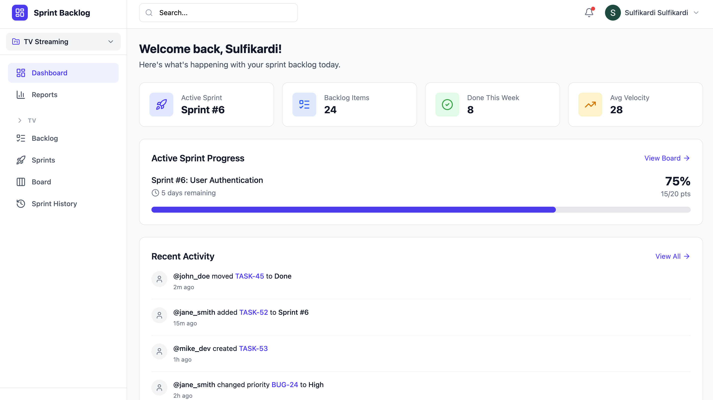
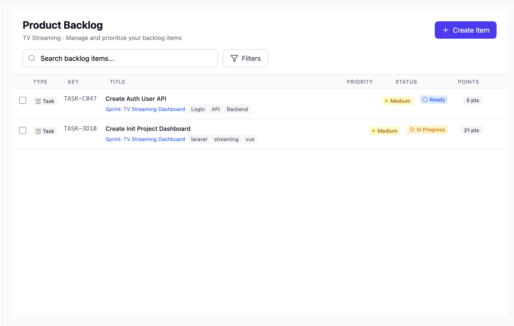
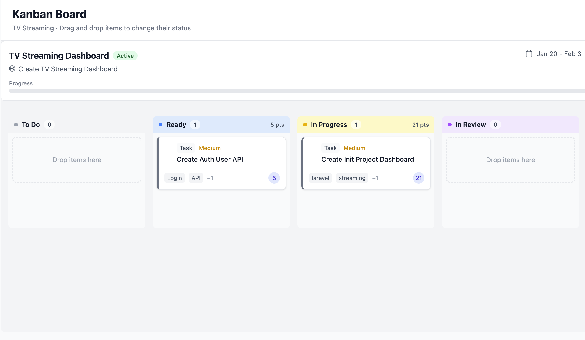
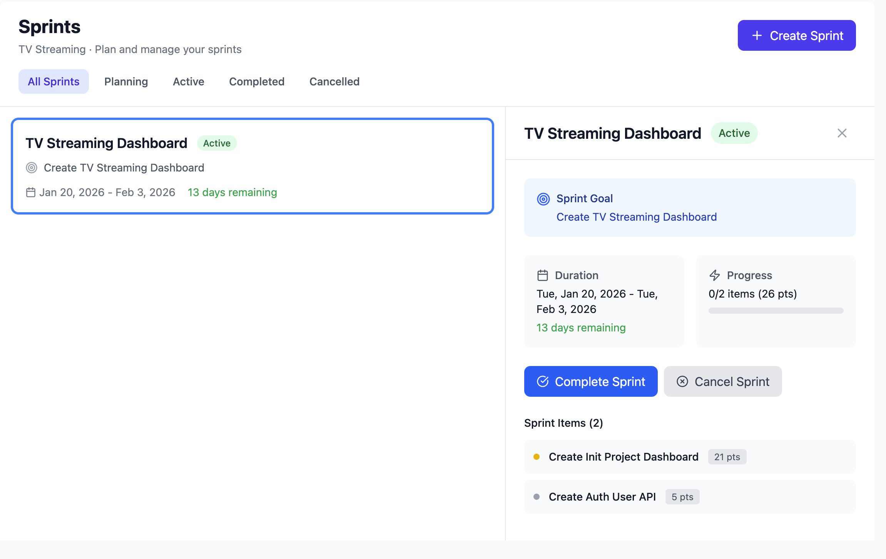

# Sprint Backlog

A full-stack Sprint Backlog Management System for agile teams. Built with Go/Gin backend and React/Vite frontend.

## Features

### Authentication
- Google OAuth 2.0 authentication
- JWT token-based authorization
- Secure session management

### Project Management
- Create and manage multiple projects
- Project-specific settings and configurations
- Team collaboration support

### Backlog Management
- Create backlog items (Stories, Tasks, Bugs, Epics)
- Priority levels (Critical, High, Medium, Low)
- Status tracking (New, Ready, In Progress, In Review, Done, Archived)
- Story points estimation
- Labels and tagging system
- Comments on items
- Item history tracking

### Sprint Management
- Create and plan sprints with goals
- Set sprint duration (start/end dates)
- Add/remove items from sprints
- Sprint lifecycle management (Planning → Active → Completed/Cancelled)
- Velocity tracking

### Kanban Board
- Visual drag-and-drop board
- Real-time status updates
- Column-based workflow
- Optimistic updates for smooth UX

### History & Reports
- Activity timeline for sprints
- Item change history
- Velocity charts
- Burndown charts
- Sprint reports with insights

### Dashboard
- Quick stats overview
- Active sprint progress
- Recent activity feed

## Tech Stack

### Backend
| Component | Technology |
|-----------|------------|
| Language | Go 1.24 |
| Framework | Gin |
| Database | PostgreSQL |
| ORM | GORM |
| Auth | JWT + Google OAuth |
| API Docs | Swagger (swaggo) |

### Frontend
| Component | Technology |
|-----------|------------|
| Framework | React 19 + Vite |
| Language | TypeScript |
| Styling | Tailwind CSS 4 |
| State | Zustand |
| Data Fetching | TanStack Query |
| Drag & Drop | @dnd-kit |
| Charts | Recharts |
| HTTP Client | Axios |

## Project Structure

```
sprint-backlog/
├── backend/
│   ├── cmd/api/           # Application entry point
│   ├── internal/
│   │   ├── config/        # Configuration
│   │   ├── database/      # Database connection
│   │   ├── dto/           # Request/Response DTOs
│   │   ├── handler/       # HTTP handlers
│   │   ├── middleware/    # Auth middleware
│   │   ├── models/        # GORM models
│   │   ├── repository/    # Data access layer
│   │   ├── router/        # Route definitions
│   │   ├── service/       # Business logic
│   │   └── utils/         # Utilities
│   ├── docs/              # Swagger documentation
│   └── pkg/               # Shared packages
│
├── frontend/
│   ├── src/
│   │   ├── components/    # React components
│   │   ├── hooks/         # Custom hooks
│   │   ├── lib/           # API clients & utilities
│   │   ├── pages/         # Page components
│   │   ├── store/         # Zustand stores
│   │   └── types/         # TypeScript types
│   └── public/            # Static assets
│
├── docker-compose.yml     # Docker Compose configuration
└── README.md
```

## Getting Started

### Prerequisites
- Go 1.24+
- Node.js 20.19+ or 22.12+
- PostgreSQL 15+
- Docker & Docker Compose (optional)

### Environment Variables

#### Backend (.env)
```env
# Server
PORT=8080
GIN_MODE=debug

# Database
DB_HOST=localhost
DB_PORT=5432
DB_USER=postgres
DB_PASSWORD=postgres
DB_NAME=sprint_backlog

# JWT
JWT_SECRET=your-super-secret-jwt-key

# Google OAuth
GOOGLE_CLIENT_ID=your-google-client-id
GOOGLE_CLIENT_SECRET=your-google-client-secret
```

#### Frontend (.env.local)
```env
VITE_API_URL=http://localhost:8080/api
VITE_GOOGLE_CLIENT_ID=your-google-client-id
```

### Running with Docker Compose

The easiest way to run the entire application:

```bash
# Clone the repository
git clone <repository-url>
cd sprint-backlog

# Start all services
docker-compose up -d

# View logs
docker-compose logs -f

# Stop services
docker-compose down
```

Access the application:
- Frontend: http://localhost:3000
- Backend API: http://localhost:8080
- Swagger Docs: http://localhost:8080/swagger/index.html

### Running Locally

#### Backend
```bash
cd backend

# Install dependencies
go mod download

# Run database migrations (automatic on startup)
# Start the server
go run cmd/api/main.go
```

#### Frontend
```bash
cd frontend

# Install dependencies
npm install

# Start development server
npm run dev
```

## API Documentation

The API documentation is available via Swagger UI at `/swagger/index.html` when the backend is running.

### Main Endpoints

| Method | Endpoint | Description |
|--------|----------|-------------|
| POST | `/api/auth/google/verify` | Verify Google OAuth code |
| GET | `/api/projects` | Get all projects |
| POST | `/api/projects` | Create a project |
| GET | `/api/items` | Get backlog items |
| POST | `/api/items` | Create backlog item |
| GET | `/api/sprints` | Get sprints |
| POST | `/api/sprints` | Create sprint |
| POST | `/api/sprints/:id/start` | Start a sprint |
| POST | `/api/sprints/:id/complete` | Complete a sprint |

## Development

### Backend Tests
```bash
cd backend
go test ./...
```

### Frontend Build
```bash
cd frontend
npm run build
```

## Screenshots

### Dashboard
Quick stats cards showing active sprint, backlog items, and velocity with sprint progress visualization and recent activity feed.



### Backlog
List view with filters (type, priority, status, sprint, labels), detail panel with description, comments, and history tabs.



### Kanban Board
Drag-and-drop cards between columns with visual status indicators and sprint information header.



### Sprint
Sprint planning and management view with goals, duration settings, and item allocation.



## License

MIT License
